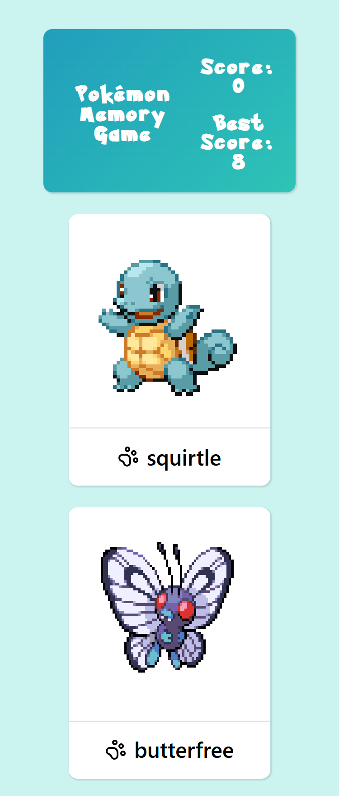

# Memory Game

## Introduction
A responsive Pokémon memory game built with React, where players test their memory by clicking on each Pokémon only once. After every correct selection, the cards reshuffle to increase the challenge. 

If the players click on the same Pokémon twice, the game resets.

## Features
* __Dynamic Card Shuffling__ – Every correct selection reshuffles the Pokémon cards.
* __Score Tracking__ – Displays your current score and best score.
* __Responsive Design__: Optimized for desktops, tablets, and mobile devices.

## Technologies Used
* React
* Vite
* Lucide (for icons)

## Project Link
You can view this project [here](https://alexs1302-memory-game.vercel.app/)!

## Project Interface (Screenshots)
### Desktop View

### Mobile view

## Credits
This project was created as part of The Odin Project's curriculum, a free online resource for learning web development.
